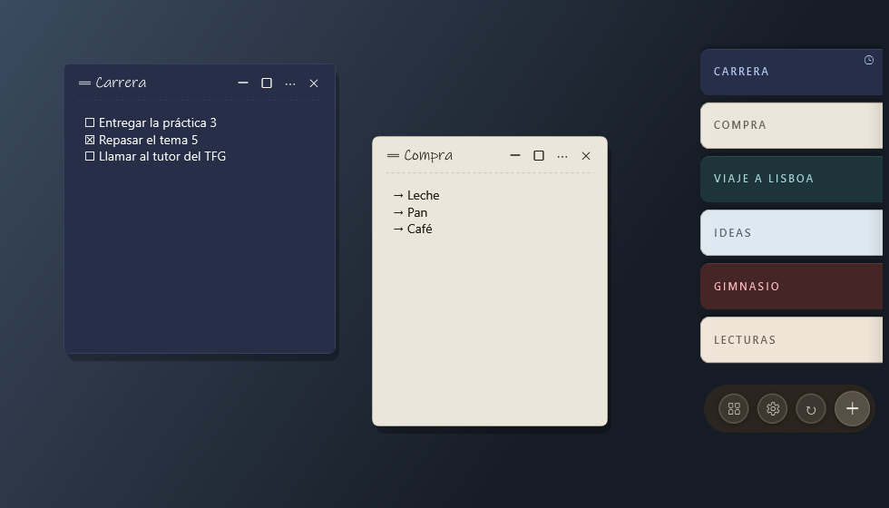

# Aldune

**Notes on the edge of your screen.** Aldune is a sticky-notes app for Windows: your notes live as a
deck of tabs on one edge of the screen, fan out when you hover over them and open as windows of
their own. No account, no required cloud, and the content is encrypted.

[Español](README.md)



## What it does

- **A dock on the edge of the screen**, on any of the four edges, on every screen or just one. It
  hides by itself during full-screen games and videos.
- **Tasks and lists** inside each note (`Ctrl+L`, `Ctrl+Shift+L`), with indentation, and an option to
  remove completed tasks after a while.
- **Reminders**, **tags**, **archive** and **trash**, plus a manager to search and organize.
- **Color themes**: Classic, Serene and Graphite, with light, dark or alternating notes, or your own.
- **A global shortcut** to create a note from anywhere (`Ctrl+Shift+N` by default).
- **Password-protected notes**, encrypted with a key derived from the password (which is not stored).
- **Optional sync** between devices through a shared folder or NAS, your own server (Docker) or
  WebDAV / Nextcloud, end-to-end encrypted. See [docs/SYNC.md](docs/SYNC.md) (in Spanish).
- **Automatic backups**: one a day, the 7 most recent are kept.
- In **English** and **Spanish**.

## Install

Download the latest version from [Releases](https://github.com/NachoPola16/aldune/releases):

- **Installer** (`Aldune-Setup-x.y.z.exe`): shortcuts and an uninstaller. No administrator rights
  needed. Uninstalling does not delete your notes.
- **Portable** (`aldune-portable-win-x64.zip`): a single `aldune.exe`, nothing to install.

Requirements: 64-bit Windows 10 or 11. You don't need to install .NET.

If Windows shows "Windows protected your PC", it's because the executable isn't signed yet: click
"More info" and "Run anyway".

## Privacy and security

Your notes are stored in `%LOCALAPPDATA%\Aldune`, on your computer. The text of each note is
encrypted with AES-256-GCM, and the key is protected by your Windows user. Aldune has no account and
no server of its own. The only things that leave your computer are sync, if you turn it on (and
only to the storage you choose), and a daily request to GitHub to tell you about new versions.

Sync encrypts the content before it leaves your computer: the storage can't read your notes or
fabricate changes to them. The details, including what it does **not** protect, are in
[docs/SYNC.md → Modelo de seguridad](docs/SYNC.md#modelo-de-seguridad).

## Build from source

On Windows with the .NET 10 SDK:

```powershell
dotnet build Aldune.slnx -c Release
dotnet test Aldune.slnx -c Release
./scripts/build-installer.ps1   # portable and installer in dist/ (needs Inno Setup 6)
```

How a version is released and signed: [docs/RELEASING.md](docs/RELEASING.md).

## License

[GPL-3.0](LICENSE). You can use, study, modify and share Aldune; if you distribute a modified
version, it has to remain free under the same license.
