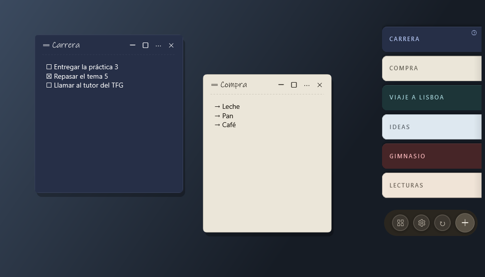

# Aldune

**Notas al borde de tu pantalla.** Aldune es una app de notas adhesivas para Windows: tus notas
viven como un mazo de pestañas en un borde de la pantalla, se despliegan en abanico al pasar el
ratón y se abren como ventanas propias. Sin cuenta, sin nube obligatoria, y con el contenido cifrado.

[English](README.en.md)



## Qué hace

- **Dock en el borde de la pantalla**, en cualquiera de los cuatro, en todas las pantallas o en una.
  Se oculta solo ante juegos y vídeos a pantalla completa.
- **Tareas y listas** dentro de cada nota (`Ctrl+L`, `Ctrl+Mayús+L`), con sangría, y la opción de
  borrar solas las tareas hechas pasado un tiempo.
- **Recordatorios**, **etiquetas**, **archivo** y **papelera**, y un gestor para buscar y ordenar.
- **Temas de color**: Clásico, Sereno y Grafito, con notas claras, oscuras o alternando, o los tuyos.
- **Atajo global** para crear una nota desde cualquier sitio (por defecto `Ctrl+Mayús+N`).
- **Notas con contraseña**, cifradas con una clave que sale de la contraseña (que no se guarda).
- **Sincronización opcional** entre dispositivos por carpeta compartida o NAS, por tu propio
  servidor (Docker) o por WebDAV / Nextcloud, cifrada de extremo a extremo. Ver
  [docs/SYNC.md](docs/SYNC.md).
- **Copias de seguridad automáticas**: una al día, se guardan las 7 más recientes.
- En **español** e **inglés**.

## Instalar

Descarga la última versión desde [Releases](https://github.com/NachoPola16/aldune/releases):

- **Instalador** (`Aldune-Setup-x.y.z.exe`): accesos directos y desinstalador. No necesita permisos
  de administrador. Desinstalar no borra tus notas.
- **Portable** (`aldune-portable-win-x64.zip`): un solo `aldune.exe`, sin instalar nada.

Requisitos: Windows 10 u 11 de 64 bits. No hace falta instalar .NET.

Si Windows muestra "Windows protegió su PC", es porque el ejecutable todavía no está firmado: pulsa
"Más información" y "Ejecutar de todas formas".

## Privacidad y seguridad

Tus notas se guardan en `%LOCALAPPDATA%\Aldune`, en tu equipo. El texto de cada nota va cifrado con
AES-256-GCM, y la clave está protegida con tu usuario de Windows. Aldune no tiene cuenta ni servidor
propio. Lo único que sale de tu equipo es la sincronización, si la activas (y solo hacia el
almacén que tú elijas), y una consulta diaria a GitHub para avisarte de versiones nuevas (se puede
desactivar en Ajustes → Acerca de).

La sincronización cifra el contenido antes de que salga del equipo: el almacén no puede leer tus
notas ni fabricar cambios en ellas. El detalle, incluido lo que **no** protege, está en
[docs/SYNC.md → Modelo de seguridad](docs/SYNC.md#modelo-de-seguridad).

## Política de firma de código

Firma de código gratuita de [SignPath.io](https://about.signpath.io), certificado de
[SignPath Foundation](https://signpath.org).

Solo se firman el instalador y el ejecutable que compila GitHub Actions desde este repositorio público
(`.github/workflows/release.yml`). Cada solicitud de firma se aprueba a mano.

- Autores y revisores: [NachoPola16](https://github.com/NachoPola16)
- Aprobadores: [NachoPola16](https://github.com/NachoPola16)

Privacidad: este programa no envía información a otros sistemas de la red salvo que lo pida
expresamente quien lo usa o lo instala. Las dos excepciones se activan o se pueden desactivar: la
sincronización, que solo funciona si la configuras y solo habla con el almacén que elijas, y la
consulta diaria de versiones nuevas, que pide a GitHub la lista de versiones, no envía nada tuyo ni
de tus notas y se desactiva en Ajustes → Acerca de.

## Compilar desde el código

Con Windows y el SDK de .NET 10:

```powershell
dotnet build Aldune.slnx -c Release
dotnet test Aldune.slnx -c Release
./scripts/build-installer.ps1   # portable e instalador en dist/ (necesita Inno Setup 6)
```

Cómo se publica una versión y cómo se firma: [docs/RELEASING.md](docs/RELEASING.md).

## Documentación

- [`docs/SYNC.md`](docs/SYNC.md): sincronización, servidor propio y modelo de seguridad.
- [`docs/STATUS.md`](docs/STATUS.md): estado técnico y decisiones de implementación.
- [`docs/ROADMAP.md`](docs/ROADMAP.md): lo previsto y lo descartado, con sus razones.
- [`docs/BRANDING.md`](docs/BRANDING.md) y [`docs/RENAME_GUIDE.md`](docs/RENAME_GUIDE.md): el nombre
  de la app y cómo cambiarlo.
- [`docs/superpowers/`](docs/superpowers/): especificaciones y planes de trabajo.

## Licencia

[GPL-3.0](LICENSE). Puedes usar, estudiar, modificar y compartir Aldune; si distribuyes una versión
modificada, tiene que seguir siendo libre bajo la misma licencia.
